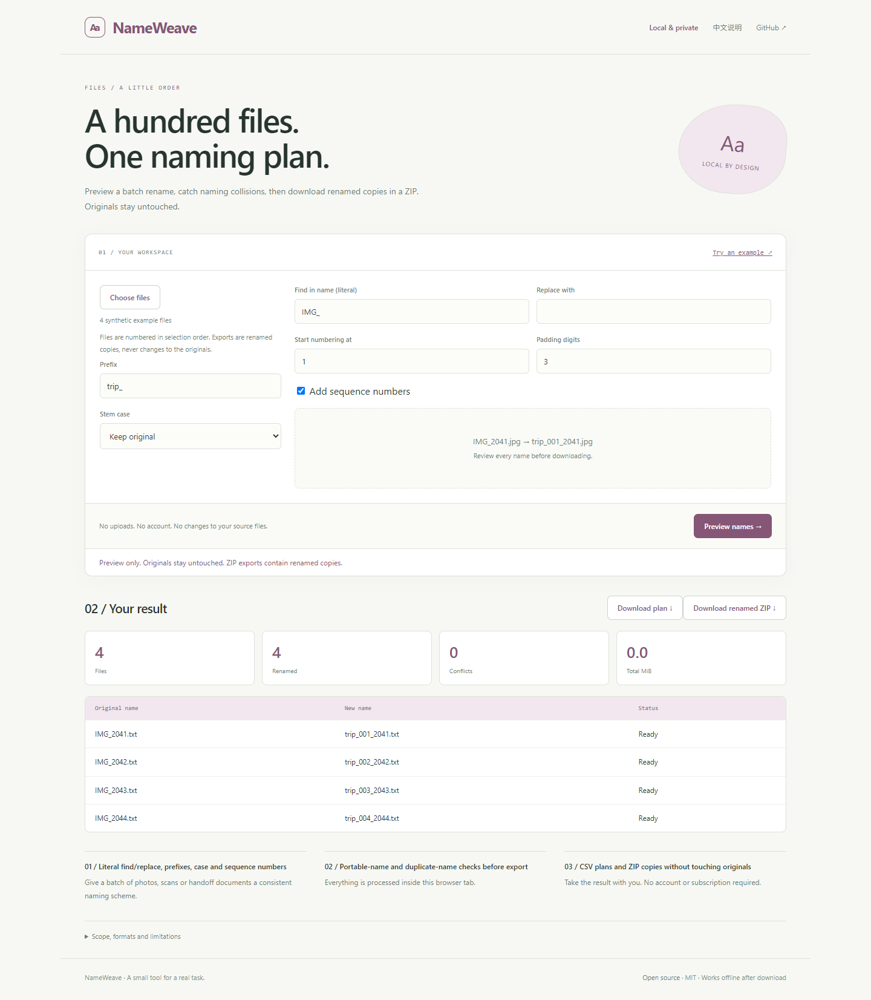

# NameWeave

**A hundred files. One naming plan.**

Preview a batch rename, catch naming collisions, then download renamed copies in a ZIP. Originals stay untouched.

[Open the app](https://sq2100.com/nameweave/) · [Download offline HTML](https://github.com/sq2100/nameweave/releases/latest) · [简体中文](README.zh-CN.md)



## Why use it?

Give a batch of photos, scans or handoff documents a consistent naming scheme.

- Literal find/replace, prefixes, case and sequence numbers
- Portable-name and duplicate-name checks before export
- CSV plans and ZIP copies without touching originals

No uploads, account, API key, tracking scripts, or runtime CDN dependencies. The built app is a single HTML file. Source files are never modified.

## Quick start

Open the [hosted app](https://sq2100.com/nameweave/) and click **Try an example**. Or download the HTML from [Releases](https://github.com/sq2100/nameweave/releases/latest), then open it in a modern desktop browser.

To build from source (Node.js 20.19+):

```sh
npm ci
npm test
npm run build
```

Open `dist/index.html`, or run `npm start` for a local preview at http://127.0.0.1:4178. Set the `PORT` environment variable to run multiple projects simultaneously.

## Scope and limitations

Select flat files, up to 2,000 entries and 100 MiB total for ZIP export. ZIP assembly buffers data in memory and uses stored entries without compression; large batches can still consume substantial memory. File extensions are preserved. The app does not write to your source folder. Case-insensitive, Unicode-normalized collisions and common Windows-invalid names block ZIP export. Not a complete validator for every filesystem. No folders, regex or arbitrary code rules.

The initial version targets modern desktop browsers. Chromium is used for local smoke checks. Browser differences and real-world data may reveal additional edge cases; please report reproducible problems with synthetic examples. No guarantee of suitability for every input is made.

## Privacy

The app processes data in memory and has no application server, analytics, cookies, local storage or external runtime resources. A Content Security Policy blocks network connections and external scripts. User data is rendered as text, except for the intentionally previewed local images and validated colors.

The hosting provider receives normal page-request metadata (such as IP addresses). Download the HTML and open it offline for disconnected work. Exported files may contain your data. Browser extensions, the operating system and a modified hosted copy are outside this app's control.

## Development

Plain JavaScript, browser APIs, Node’s built-in test runner, and esbuild. Core logic lives in `src/core.js`; UI behavior is in `src/app.js`. Run `npm run format` before sending changes. GitHub Actions tests and builds each push; the separate Pages workflow publishes the demo when run manually.

[Contributing](CONTRIBUTING.md) · [Security](SECURITY.md) · [MIT license](LICENSE)
